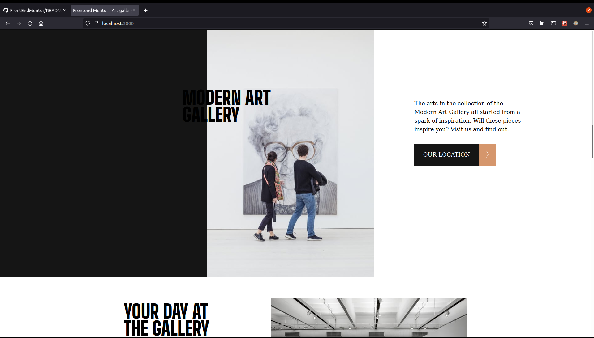

# Frontend Mentor - Art gallery website solution

This is a solution to the [Art gallery website challenge on Frontend Mentor](https://www.frontendmentor.io/challenges/art-gallery-website-yVdrZlxyA). Frontend Mentor challenges help you improve your coding skills by building realistic projects. 

## Table of contents

- [Overview](#overview)
  - [The challenge](#the-challenge)
  - [Screenshot](#screenshot)
  - [Links](#links)
- [My process](#my-process)
  - [Built with](#built-with)
  - [What I learned](#what-i-learned)
  - [Continued development](#continued-development)
  - [Useful resources](#useful-resources)
- [Author](#author)
- [Acknowledgments](#acknowledgments)


## Overview

### The challenge

Users should be able to:

- View the optimal layout for each page depending on their device's screen size
- See hover states for all interactive elements throughout the site
- **Bonus**: Use [Leaflet JS](https://leafletjs.com/) to create an interactive location map with custom location pin

### Screenshot




### Links

- Solution URL: [Code](https://github.com/manny2384/FrontEndMentor/tree/main/gallery/src)
- Live Site URL: [Website](https://zealous-wright-cb2f9c.netlify.app/)

## My process

### Built with

- Semantic HTML5 markup
- CSS custom properties
- Flexbox
- Mobile-first workflow
- [React](https://reactjs.org/) - JS library


### What I learned

In this project I learned about the flow of flex box along with media queries to customize a design according to the client viewport. 
```css
@media only screen and (min-width: 1150px){
  .hero-section{
    display: flex;
    justify-content: flex-start;

  }
  
  .hero-description{
    flex-direction: row;
    justify-content: space-between;
    width: min(60%, 1100px);
    left: 30%;
  }
  .hero-description .big-word{
    width: 300px;
  }
  .hero-description .small-word{
    width: 350px;
  }

  .black-wall{
    display: inline-block;
    flex-grow: 0.4;
  }
}
```

I also learned how to use the [picture](https://developer.mozilla.org/en-US/docs/Web/HTML/Element/picture) element for multiple platforms - In this case: mobile, tablet and desktop.

```html
  <picture>
    <source media="(min-width:1000px)" srcSet={hero} />
    <source media="(min-width:700px)" srcSet={tabhero} />  
    
  </picture> 
```

Currently I've been learning more of React and used this project to make a simple functional component with only one state variable
```js
  const [page, setPage] = useState(true);
  useEffect(()=>{
    console.log('re-rendering');

  }, [page]);
```

### Continued development

In the challenge project, the text changes color midway depending on background. This is one effect I am still tackling. 


## Author

- Website - [Emmanuel Gonzalez Github](https://github.com/manny2384)
- Frontend Mentor - [@manny2384](https://www.frontendmentor.io/profile/many2384)

## Acknowledgments
