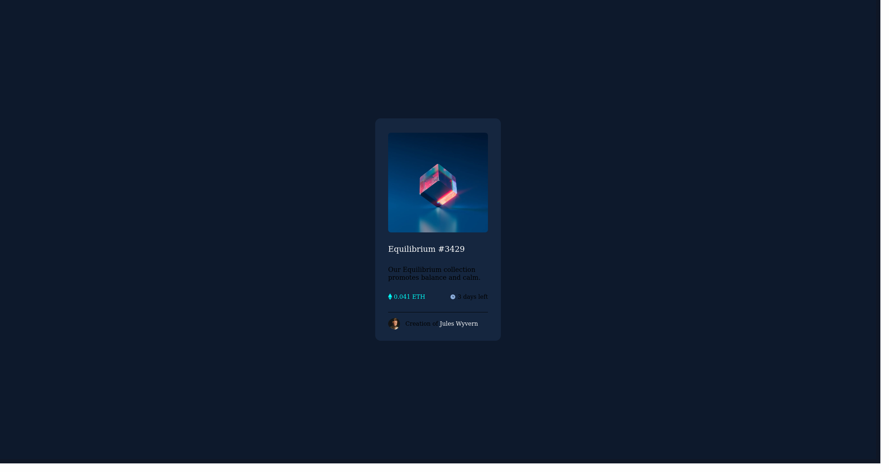

# Frontend Mentor - NFT preview card component solution

This is a solution to the [NFT preview card component challenge on Frontend Mentor](https://www.frontendmentor.io/challenges/nft-preview-card-component-SbdUL_w0U). Frontend Mentor challenges help you improve your coding skills by building realistic projects. 

## Table of contents

- [Overview](#overview)
  - [The challenge](#the-challenge)
  - [Screenshot](#screenshot)
  - [Links](#links)
- [My process](#my-process)
  - [Built with](#built-with)
  - [What I learned](#what-i-learned)
  - [Continued development](#continued-development)
  - [Useful resources](#useful-resources)
- [Author](#author)
- [Acknowledgments](#acknowledgments)

## Overview

### The challenge

Users should be able to:

- View the optimal layout depending on their device's screen size
- See hover states for interactive elements

### Screenshot




### Links

- [Solution URL](https://your-solution-url.com)
- [Live Site URL](https://zealous-curie-bb2083.netlify.app/)

## My process

### Built with

- Semantic HTML5 markup
- CSS custom properties
- Flexbox
- CSS Grid
- Mobile-first workflow
- [React](https://reactjs.org/) - JS library
- [Styled Components](https://styled-components.com/) - For styles

### What I learned

I learned how to use JSX and REACT a lot more by taking this challenge. Some of the concepts were inline css such as the following 

```html
  <div className="specs">
    <span style={{"color": '#00FFF8'}}>  0.041 ETH </span>
    <span>  3 days left </span>
  </div>

```


### Continued development

One of my realizations is was that it's easy to style for one screen/platform, but creating a responsive layout takes more practice. Which I plan to continue as I take on more challenges.


### Useful resources


## Author

- Website - [My current Github](https://github.com/manny2384)
- Frontend Mentor - [@manny2384](https://www.frontendmentor.io/profile/yourusername)


## Acknowledgments

Although the code was built just by me, the design was created by Jules Wyvern

